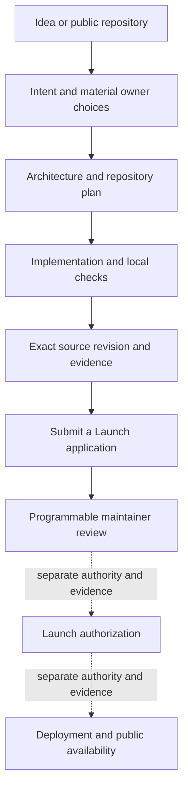

<p align="center">
  
</p>

<h1 align="center">Programmable v4 Builder</h1>

<p align="center">
  A portable Agent Skill for turning a product idea or an existing repository into a complete, reviewable Programmable project with explicit evidence.
</p>

<p align="center">
  Maintained by Programmable · Developed in public · MIT licensed
</p>

<p align="center">
  <a href="https://github.com/0xprogrammable/hookbuilder/actions/workflows/ci.yml"></a>
  <a href="LICENSE"></a>
  <a href="https://agentskills.io/specification"></a>
  <a href="CHANGELOG.md"></a>
</p>

<p align="center">
  <a href="#install-the-published-release">Install</a> ·
  <a href="docs/AGENT_SKILL.md">Use the Builder</a> ·
  <a href="CONTRIBUTING.md">Contribute</a> ·
  <a href="SECURITY.md">Security</a>
</p>

> [!IMPORTANT]
> **Release status**
>
> Release package `v0.9.3` supports Node.js 22+ for the portable Skill; source and release gates require Node.js 24+. Its bundled status retains
> `publicationStateVerified: false`; verify the public tag, GitHub release, and installed bytes before treating it as
> published or live. Package checks and public CI do not establish model behavior, an independent audit, project approval,
> deployment, routing, registration, or launch authority.

Programmable v4 Builder is an evidence-first [Agent Skill](https://agentskills.io/specification). It accepts a plain
idea or an existing public repository. Hooks, tokens, apps, games, services, standalone settlement systems, and mixed
projects can all be modeled.

The Builder does not limit unfamiliar work to a fixed catalog. Starters and capability packs speed up repeated work;
unknown ideas remain eligible for architecture review. Local checks stay separate from maintainer review, launch
authority, deployment, provider support, and public availability.

## Install the immutable release

After confirming that GitHub exposes the immutable `v0.9.3` release, preview that exact Skill before installing it:

```bash
gh skill preview 0xprogrammable/hookbuilder \
  programmable-v4-hook-builder@v0.9.3
```

Install the same immutable release for Codex:

```bash
gh skill install 0xprogrammable/hookbuilder \
  skills/programmable-v4-hook-builder \
  --agent codex \
  --scope user \
  --pin v0.9.3
```

GitHub's `gh skill` commands are in preview. Clean package placement has been checked for Codex, Claude Code, and
GitHub Copilot; host behavior remains a separate question. See
[Portability and lifecycle](docs/PORTABILITY_AND_LIFECYCLE.md) before choosing another destination.

From the installed Skill directory, verify its package:

```bash
node scripts/verify-skill.mjs --installed
```

At the start of each build, `cli.mjs policy` reads the exact current `0xprogrammable/submit-launch:main` build rules.
Those returned Rule IDs are the only Programmable launch requirements; bundled security guidance cannot add another.

Then give your agent one clear request:

```text
Use the Programmable v4 Builder skill. Build and check this project, then prepare its exact application for Submit a Launch. Submit the draft only when I explicitly authorize the GitHub write: <idea or public GitHub URL>
```

## What the Builder does

| Stage | Output |
| --- | --- |
| Understand | Preserves the stated product intent and isolates the owner choices that materially change it. |
| Design | Produces the smallest complete architecture, capability graph, value flow, and repository plan. |
| Build | Uses composable starters and capability packs without treating them as an allowlist. |
| Check | Runs deterministic validation, intent-fidelity checks, security boundaries, and executable evidence where available. |
| Bind | Closes over the exact public source repositories, commits, trees, files, and required evidence. |
| Prepare | Freezes the exact source revision and evidence needed by a separate Applicant review request. |

The Builder loads only the protocol, runtime, liquidity, service, and security material relevant to the confirmed
project. Every canonical catalog capability must have an explicit knowledge route or routing fails closed. The optional
Project Compiler `--brief` view shortens presentation only; it preserves the full report identity, result, and evidence
boundary.



Inspect the local router on the development source:

```bash
node skills/programmable-v4-hook-builder/scripts/cli.mjs context --mode explore
```

## Submit a hook for review

All new one-off applications go through the Builder to
[`0xprogrammable/submit-launch`](https://github.com/0xprogrammable/submit-launch), immutable GitHub repository ID
`1320171831`. Project source stays in the builder's own public repository.

Complete custom `no-market` and `tradable` projects now have one generic deterministic `handoff preview`. It preserves
the full source/test/evidence surface inventory, validates exact policy/schema preimages, derives active build rules,
and binds the exact source revision, Submit a Launch base, and intended draft-PR identity. Preview is no-write and
returns the complete LF-terminated artifact in `canonicalApplicationHandoffJson`; the portable local-write boundary
also fails closed until a reviewed `O_NOFOLLOW | O_CREAT | O_EXCL` descriptor-bound writer exists. See the
[generic handoff contract](skills/programmable-v4-hook-builder/references/application-handoff.md).

That generic handoff is not yet a public GitHub submission adapter. A remote write remains unavailable until Submit a
Launch exposes a protected accepted generic application schema. It never means reviewed, approved, deployed, or live.

`prepare-pr` creates the exact six-file application without changing GitHub. `submit` and `update` first return a
read-only action plan. Only the exact confirmed plan may create the builder's `submit-launch` fork, application branch,
and one draft pull request. The client reads `docs/builder/intake-status.json` as the released schema-v2 contract and
stops before any write unless intake permits that exact application or continuation. Do not hand-create an application
pull request.

`prepare-canary` is a separate hidden, non-production workflow-test path. It returns the exact canonical
`application.json` bytes and plan digest. Automated local writing currently fails closed because the portable client
does not yet bundle a descriptor-bound writer; it never writes GitHub or grants launch authority. See the
[workflow-canary client contract](skills/programmable-v4-hook-builder/references/workflow-canary-application.md).

The older Applicant files in this Hookbuilder repository are frozen legacy continuations. Only pull requests #10,
#11, #12, #14, #15, #18, #19, and #20 may continue on that path, and only against Hookbuilder `main`. Every new
application belongs in Submit a Launch.
Neither path approves, deploys, signs, routes, or launches a project. See the
[Submit a Launch guide](docs/PUBLIC_GITHUB_PR_BETA.md).

## Build it with us

The Builder is maintained by Programmable and developed in public. Contributions are welcome when they improve its
accuracy, composability, efficiency, testability, portability, or documentation without weakening evidence bounds.

| If you found or need | Start here |
| --- | --- |
| A reproducible defect | [Open a bug report](https://github.com/0xprogrammable/hookbuilder/issues/new?template=bug.yml) |
| A missing capability, source, or integration | [Propose a capability](https://github.com/0xprogrammable/hookbuilder/issues/new?template=capability.yml) |
| A code, documentation, template, or evaluation change | [Read the contribution guide](CONTRIBUTING.md) |
| A possible vulnerability | [Report it privately](SECURITY.md) |

Each rule has one owning layer. Change the canonical contract and its tests instead of copying policy into several
files. Pull requests should name the problem, owning layer, checks run, and remaining evidence boundary.

## Evidence boundaries

| A result can establish | It does not establish |
| --- | --- |
| A specific local check passed for exact bytes | An independent audit or a guarantee that code is safe |
| A package was placed and verified for one host directory | That the host selected or executed the Skill correctly |
| An exact Applicant review request was prepared | Maintainer acceptance, launch authorization, or deployment |
| Deployment or source/runtime evidence exists | Provider indexing, quoting, simulation, execution, or public availability |
| A project resembles an existing template or model | Duplication, ineligibility, or unsafe behavior |

The Builder builds and checks. It does not approve routes, execute trades, audit, deploy, list, endorse, or launch.
Every external write, signature, deployment, publication, credentialed provider action, and material cost requires
separate authority.

<details>
<summary><strong>Technical contracts kept explicit on <code>main</code></strong></summary>

- Fee applicability follows the exact project graph. Zero-scope work must not invent a market, PoolKey, hook, or fee
  receipt.
- Each Programmable-canonical execution scope preserves the inclusive 10 bps share of executed gross quote-side swap
  or fill volume exactly once. Claim authority and platform administration remain separate roles.
- Fee V2 names four settlement profiles. The bundled Solidity kernel evidences only `standard-amm`; every other profile
  needs its own implementation, custody proof, tests, and review.
- Public Applicant review requires exact public GitHub source. Local, private, ZIP-packaged, pasted, or non-GitHub
  source can support exploration but cannot enter the public review path.
- Applicant requests and local Launch Bundles remain review-only and `NOT_AUTHORIZED`; neither grants production or
  launch authority.

Read the canonical details in [Open-World V2 architecture](docs/OPEN_WORLD_V2_ARCHITECTURE.md),
[Security and review](docs/SECURITY_AND_REVIEW.md), and
[Programmable platform boundaries](docs/PLATFORM_INTEGRATION.md).

</details>

## Repository map

```text
skills/programmable-v4-hook-builder/   canonical portable Skill
  references/                         routed knowledge, schemas, and policy
  assets/                             starters, capability packs, reference kernels
  scripts/                            deterministic tools and package tests
evals/                                adversarial agent evaluations
docs/                                 usage, architecture, security, release records
submissions/                          frozen legacy Applicant contracts and continuations
config/plugin.json                    canonical host metadata
plugins/programmable-v4-builder/      generated, byte-verified Codex payload
mcp/ and .mcp.json                    canonical Codex-only MCP companion
```

The portable Skill and root MCP files are canonical. Generated manifests and the Codex payload remain byte-aligned
with them. See [Architecture](docs/ARCHITECTURE.md) before changing package or host metadata.

## Verify from source

Node.js 24 or newer is required and CI verifies the Node 24 line. The repository has no npm runtime or development dependencies.

```bash
npm test
gh skill publish --dry-run
```

The two bundled reference fee kernels additionally use Foundry:

```bash
cd skills/programmable-v4-hook-builder/assets/reference-kernels/programmable-volume-fee-v1
forge test
cd ../programmable-volume-fee-v2
forge test
```

Model-backed evaluations are separate because they require provider credentials and may cost money. `npm test` still
validates their structure; an unavailable model result or provider receipt is never treated as passed.

## Documentation

| Goal | Documents |
| --- | --- |
| Use the Builder | [Agent Skill guide](docs/AGENT_SKILL.md) · [Applicant submission beta](docs/PUBLIC_GITHUB_PR_BETA.md) |
| Understand the system | [Architecture](docs/ARCHITECTURE.md) · [Open-World V2](docs/OPEN_WORLD_V2_ARCHITECTURE.md) · [Knowledge routing](docs/KNOWLEDGE_SYSTEM.md) |
| Extend it safely | [Templates and extensions](docs/TEMPLATES_AND_EXTENSIONS.md) · [Security and review](docs/SECURITY_AND_REVIEW.md) · [Contribution guide](CONTRIBUTING.md) |
| Inspect portability and releases | [Portability and lifecycle](docs/PORTABILITY_AND_LIFECYCLE.md) · [Release gates](docs/OPEN_WORLD_V2_RELEASE_GATES.md) · [Release process](docs/RELEASING.md) |

Submit a Launch is the canonical public Applicant pull-request surface. Project source stays in the Applicant's own
public GitHub repository; review remains separate from platform contracts, routing, deployment, and the Explorer.

## License and independence

Programmable v4 Builder is independent open-source software under the [MIT License](LICENSE). Uniswap is a source
protocol and ecosystem referenced by the Builder. This repository does not claim affiliation with or endorsement by
Uniswap Labs or the Uniswap Foundation.
