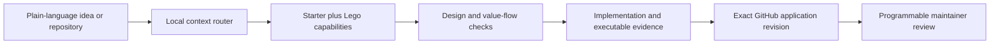

<p align="center">
  
</p>

<h1 align="center">Programmable v4 Builder</h1>

<p align="center">
  Describe a Uniswap v4 product. Give the same portable skill to your coding agent. Build, check, and prepare one exact GitHub application.
</p>

<p align="center">
  <a href="https://github.com/0xprogrammable/programmable-v4-builder/actions/workflows/ci.yml"></a>
  <a href="LICENSE"></a>
  <a href="https://agentskills.io/specification"></a>
  <a href="CHANGELOG.md"></a>
</p>

Programmable v4 Builder is an evidence-first [Agent Skill](https://agentskills.io/specification) for open-ended Uniswap
v4 projects. It combines current protocol mechanics, official SDK and periphery integration rules, Programmable's
platform contract, reusable planning blocks, deterministic checks, adversarial evaluations, and a GitHub application
workflow in one versioned package.

It is built for ordinary token launches and unfamiliar ideas alike: custom hooks, games, maps, wallet quests, auctions,
dynamic fees, transfer taxes, automatic liquidity, external services, active-liquidity markets, wrapped assets,
position automation, and architectures that do not have a catalog name yet. Templates accelerate repeated work; they
never define what builders are allowed to invent.

## Install

The shortest interactive command is:

```bash
gh skill install 0xprogrammable/programmable-v4-builder
```

For a reproducible Codex installation pinned to this release:

```bash
gh skill install 0xprogrammable/programmable-v4-builder \
  programmable-v4-hook-builder@v0.4.0 \
  --agent codex \
  --scope user
```

Replace `codex` with `claude-code`, `github-copilot`, `cursor`, `gemini-cli`, or another host supported by `gh skill`.
The GitHub CLI skill commands are currently a preview feature. Installation grants no wallet, deployment, publication,
approval, or external-account authority.

Then tell the agent:

```text
Use the Programmable v4 Builder skill. Turn this idea into a complete checked project and prepare its GitHub application: <your idea>
```

For an existing project:

```text
Use the Programmable v4 Builder skill. Inspect this repository, preserve the intended product, repair objective findings, and prepare one exact GitHub application revision: <repository URL>
```

## Why this is more than a documentation page

Documentation explains. This package also gives the agent deterministic machinery:

- a local knowledge router that loads only the chapters required for the current job;
- composable starters and capability packs with hash-bound provenance;
- a versioned submission schema and semantic validator;
- project scaffolding, package closure, review-target and fee-conformance tools;
- exact public GitHub source resolution and a bounded application package;
- read-only application status plus two-step confirmation for an authorized draft submission;
- upstream source drift detection, migrations, release planning, and installed-package verification; and
- adversarial evals for protocol, SDK, liquidity, signing, claims, creativity, repository and external-action failures.

## One idea, progressive context

The agent does not preload the entire knowledge base.



An ordinary launch preflight currently selects about 17,000 estimated tokens and avoids unrelated game, SDK, and
advanced-hook chapters. More complex products add the relevant protocol, runtime, service, liquidity, or security
context. An unknown capability is preserved and routed to architecture review; it is never automatically called unsafe
because a classifier did not recognize it.

Try the router locally:

```bash
node skills/programmable-v4-hook-builder/scripts/cli.mjs context --mode explore
```

## Product rules that do not disappear inside templates

Every launch-ready canonical pool must enforce Programmable's inclusive 10 bps share of executed gross quote-side swap
volume in its one fee-enforcing hook. If a builder selects a 3% total hook-owned swap charge, the total remains 3%:
0.1% Programmable and 2.9% project. The immutable claim authority is
`0x4957f49620AFf3Adbbe8195a4f633E49cc93376c`; the separate platform admin cannot claim or redirect it.

The Builder keeps these states separate:

1. idea and design eligibility;
2. implementation conformance;
3. Programmable maintainer review;
4. deployment and source/runtime verification;
5. provider-specific indexing, quoting, simulation, and execution; and
6. public availability.

A local green check proves only the exact local check. It is not an audit, approval, deployment, provider statement,
Uniswap endorsement, or guarantee that code is safe or rug-free.

## Repository map

```text
skills/programmable-v4-hook-builder/   portable source installed by agents
  SKILL.md                             small operating contract and router entry
  references/                         progressively loaded knowledge and schemas
  assets/starter-catalog/              starters and composable capability packs
  assets/reference-kernels/            reviewed implementation candidates and tests
  scripts/                             deterministic local tools
  scripts/test/                        portable package tests
evals/                                 adversarial agent evaluation suite
docs/                                  architecture, usage, source and review records
config/plugin.json                     single host-metadata source
.codex-plugin/                         generated Codex manifest
.claude-plugin/                        generated Claude manifest and marketplace
scripts/verify-repository.mjs          complete local repository gate
```

The portable skill is canonical. Host manifests are generated from `config/plugin.json`; they do not copy or redefine
the policy. See [Architecture](docs/ARCHITECTURE.md) for the ownership and upgrade boundaries.

## Verify from source

Node.js 20 or newer is required. The repository has no npm runtime or development dependencies.

```bash
npm test
gh skill publish --dry-run
```

The reference fee kernel additionally uses Foundry:

```bash
cd skills/programmable-v4-hook-builder/assets/reference-kernels/programmable-volume-fee-v1
forge test
```

Model-backed eval execution is deliberately separate because it requires an explicit provider credential and can cost
money. Structural eval validation is included in `npm test`; no model result or credential is committed.

## Documentation

- [Use the Builder with an agent](docs/AGENT_SKILL.md)
- [GitHub application journey](docs/PUBLIC_GITHUB_PR_BETA.md)
- [Architecture and surgical change map](docs/ARCHITECTURE.md)
- [Knowledge routing and token efficiency](docs/KNOWLEDGE_SYSTEM.md)
- [Templates and extension model](docs/TEMPLATES_AND_EXTENSIONS.md)
- [Security and review model](docs/SECURITY_AND_REVIEW.md)
- [Uniswap source coverage](docs/UNISWAP_MASTER_SKILL_ADOPTION.md)
- [Programmable platform boundary](docs/PLATFORM_INTEGRATION.md)
- [Release process](docs/RELEASING.md)

## Contributing and security

Read [CONTRIBUTING.md](CONTRIBUTING.md) before changing knowledge, policy, templates, schemas, validators, or release
metadata. Security reports belong in [private GitHub vulnerability reporting](SECURITY.md), not a public issue.

Programmable v4 Builder is independent open-source software. Uniswap is a source protocol and ecosystem referenced by
the Builder; this repository does not claim affiliation with or endorsement by Uniswap Labs or Uniswap Foundation.
