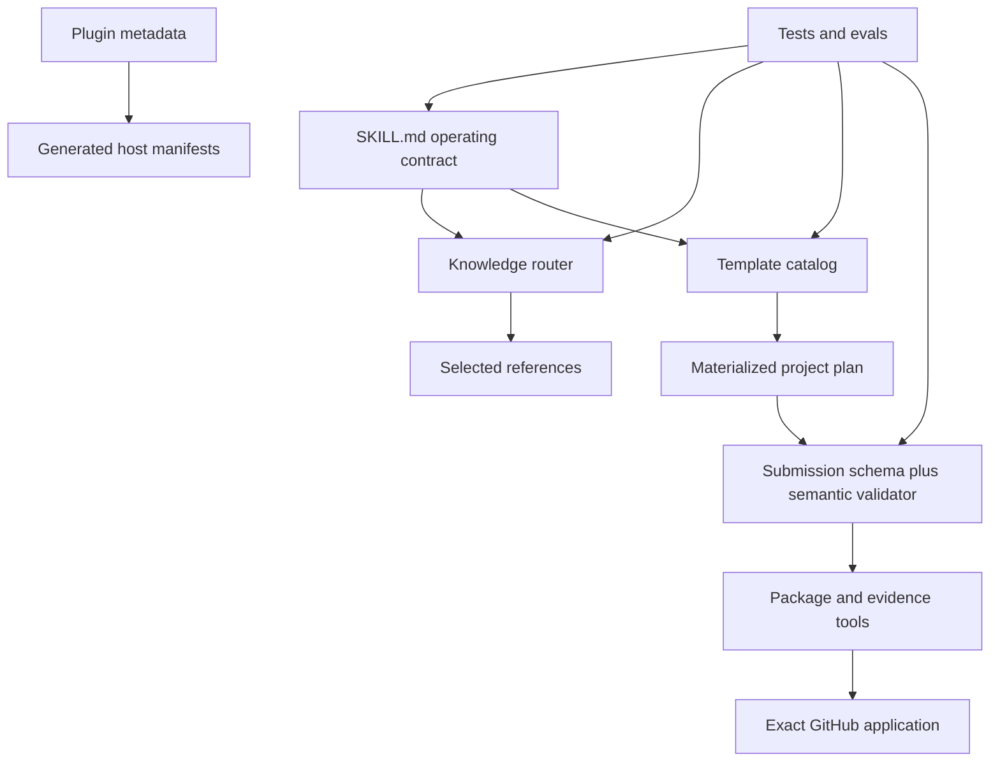

# Architecture

The repository is organized so one class of change has one canonical owner. Derived files are generated or tested
against that owner; they never become a second policy source.

## Layers

| Layer | Canonical owner | Responsibility |
| --- | --- | --- |
| Agent entry | `skills/programmable-v4-hook-builder/SKILL.md` | Modes, boundaries, commands and progressive-loading contract |
| Knowledge routing | `references/knowledge-routing.json` | Minimum initial context for each mode, capability and surface |
| Domain knowledge | `references/*.md` and bounded JSON | Uniswap, Programmable, SDK, security, platform and workflow rules |
| Composition | `assets/starter-catalog/` | Hash-bound starters, capability packs, dependencies and owner-defined extensions |
| Submission contract | `references/submission.schema.json` | Closed, versioned machine shape |
| Semantic policy | `scripts/submission-core.mjs` | Cross-field findings, readiness states and gate ledger |
| Deterministic tooling | `scripts/*.mjs` | Scaffolding, checking, packaging, source resolution, applications, status and upgrades |
| Executable evidence | `scripts/test/` and reference kernel | Unit, integration, negative, lifecycle and fee-conformance checks |
| Agent behavior | `evals/` | Adversarial prompts and binary safety rubrics |
| Host distribution | `config/plugin.json` | Neutral metadata rendered into Codex and Claude manifests |
| Repository release | root docs, CI and release process | Public source, contribution, security, provenance and immutable versions |

## Dependency direction

References may explain schemas and tools, but prose cannot override machine contracts. Templates contribute review
questions and required evidence; they do not decide eligibility. Host manifests point to the canonical package and may
not weaken its boundaries.

## Surgical change map

| Desired change | Edit first | Usually invalidates |
| --- | --- | --- |
| Add Uniswap knowledge | one focused reference and source record | router route, source drift test, related eval |
| Change what loads initially | `knowledge-routing.json` | router tests and documented context budgets |
| Add a product pattern | one capability pack | pack hash, catalog digest, catalog docs/tests, scenario coverage |
| Add an entirely novel idea | no catalog edit required | blank-custom plan and architecture review already preserve it |
| Add a submission field | schema | example, materializer, semantic validator, tests, compatibility and migration |
| Change a safety rule | semantic validator or owning reference | negative tests, eval rubric, public wording and migration impact |
| Change platform economics | fee policy | kernel, schema, validator, all fee vectors, docs and independent review |
| Change GitHub intake | application schemas/client | exact-source resolver, package closure, CLI tests and beta guide |
| Change host display metadata | `config/plugin.json` | generated manifests and repository version test |
| Release a version | changelog and private candidate | all gates, checksums, SBOM, tag, release and installation canary |

## Stable extension points

- Capability packs may add facts, files, tests, risks, surfaces and dependencies without modifying core protocol code.
- Owner-defined capabilities use lowercase ids and remain visible through materialization and application review.
- Project surfaces let one idea span contracts, applications, games, services, indexers, keepers, metadata and other
  repositories without pretending they are one contract.
- Companion manifests bind up to the supported bounded set of exact external repositories. Larger systems receive a
  transport architecture review rather than silent truncation.
- Compatibility profiles bind coherent dependency sets. Observed upstream heads never mutate released provenance.

## What stays outside this repository

The live Programmable website, database, admin panel, deployment infrastructure, provider integrations, production
indexer and wallet systems remain separate products. This repository defines the portable builder and current GitHub
application boundary. Platform code should consume one exact released Builder tag and must not silently fork its policy.
