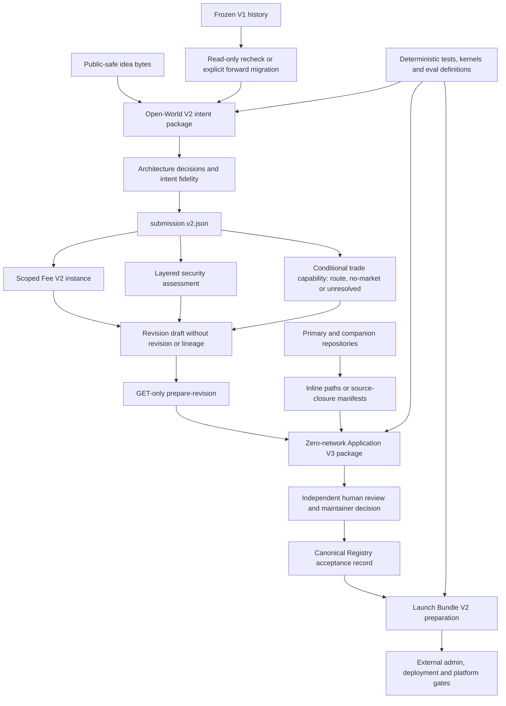

# Architecture

The repository is one portable, evidence-first Builder with version-scoped machine contracts. One class of change has
one canonical owner within its version. Historical V1 contracts remain reproducible; Open-World V2 and Application V3
add new contracts instead of silently widening or reinterpreting V1 evidence.

This document describes both released and candidate architecture; it is not a release receipt. Any claimed repository,
kernel or installation result must live in a separate receipt bound to one clean commit, repository tree and portable
skill tree. Source drift invalidates that receipt, and neither this document nor a local receipt proves publication.

## Canonical ownership by layer

In the table below, unprefixed `references/`, `scripts/`, `assets/`, `evals/` and `config/` paths resolve under
`skills/programmable-v4-hook-builder/`. Root-level paths are named explicitly.

| Layer | Canonical owner | Responsibility |
| --- | --- | --- |
| Agent entry | `skills/programmable-v4-hook-builder/SKILL.md` | Modes, authority boundaries, commands and progressive-loading contract |
| Knowledge routing | `skills/programmable-v4-hook-builder/references/knowledge-routing.json` | Minimum sufficient context for each mode, capability and product surface |
| Domain knowledge | `skills/programmable-v4-hook-builder/references/*.md` and bounded JSON | Uniswap, Programmable, SDK, security, platform and workflow rules |
| Composition | `skills/programmable-v4-hook-builder/assets/starter-catalog/` | Hash-bound starters, capability packs, dependencies and owner-defined extensions; never a product allowlist |
| Historical submission contract | `references/submission.schema.json` | Frozen V1 submission compatibility and historical recheck input |
| Open-world submission contract | `references/submission-v2.schema.json` | Open assets, markets, hooks, components, lifecycle, fee scopes and product surfaces |
| Intent package | `references/idea-source-v1.schema.json`, `intent-contract-v1.schema.json`, `architecture-decisions-v1.schema.json`, `intent-fidelity-v1.schema.json` | Exact idea provenance, confirmed intent, explicit decisions and drift visibility |
| Security assessment | `references/open-world-security-v1.schema.json` and `scripts/open-world-security-core.mjs` | Layered intent, configuration, source and runtime observations; safe-redesign and review routing without self-approval |
| Optional legacy fee package | `references/programmable-fee-policy-v2.md`, `references/fee-policy-v2.schema.json`, `scripts/fee-policy-v2-core.mjs` | Frozen inclusive 10 bps implementation semantics only when preserved intent or an applicable current central-policy Rule ID explicitly selects that package |
| Trade capability | `references/trade-capability-manifest-v1.schema.json`, `programmable-trade-execution-v1.schema.json` and `scripts/trade-capability-manifest-core.mjs` | Per-market PoolKey, router/quoter/Permit2, hook data, direction, slippage, deadline, fee and test contracts; standard Uniswap v4 or canonical adapter, always `NOT_APPROVED` |
| Historical application | `references/public-pr-application.schema.json` | Frozen pre-V3 application compatibility and immutable history |
| Public application | `references/public-pr-application-v3.schema.json` and `scripts/public-pr-application-v3-core.mjs` | GitHub-only Application V3 intent, review, source and policy closure for every complete project with exact public source and a valid closed package; trusted sandbox completion is optional evidence, while publication still requires its own confirmed draft request and protected review |
| Public Applicant intake | `scripts/registry-intake-contract.mjs` plus the namespaced open-world GitHub client | Generated, draft-only review requests to `0xprogrammable/submit-launch`, immutable repository ID `1320171831`, exact protected active-contract and Application V3 schema binding, exact source/package binding, and no approval, Router, deployment, or launch write |
| Legacy Hookbuilder intake | Root `submissions/` schema, example and validator | Frozen continuations for Hookbuilder pull requests #10, #11, #12, #14, #15, #18, #19, and #20 only; never a new Applicant route |
| Large source closure | `references/source-closure-manifest-v1.schema.json` | Ordered, content-addressed manifest and fragment contract for large primary or companion repositories |
| Registry acceptance | `references/registry-acceptance-v3.schema.json` and `scripts/registry-acceptance-v3-github-core.mjs` | Historical Application V3 acceptance architecture; current requirements and outcomes come only from the exact central Submit Launch policy, while mocked transport remains inspection-only and grants no authority |
| Launch preparation | `references/launch-bundle-input-v2.schema.json`, `launch-bundle-output-v2.schema.json` and `scripts/launch-bundle-v2*.mjs` | Exact multi-repository preparation report that always remains unsigned and `NOT_AUTHORIZED` |
| Semantic policy | Version-matched validators under `scripts/` | Cross-field findings, evidence states, migration rules and gate ledger |
| Executable evidence | `test/portable-skill/` and versioned reference kernels | Unit, integration, negative, lifecycle, fee-conformance and source-closure checks |
| Portable package boundary | `skills/programmable-v4-hook-builder/portable-package.json` | Exact installed-file inclusion plus digest-bound repository-only test evidence; plugin and release packaging consume this manifest |
| Agent behavior | `evals/` | Adversarial prompts and binary safety rubrics, separate from deterministic tests |
| External E2E evidence intake | `scripts/evals/e2e-external-evidence-core.mjs` | Signature and source-binding verification without treating a caller-selected policy as an independent trust root |
| Host distribution | `config/plugin.json` | Neutral metadata rendered into supported host manifests |
| Repository release | Root docs, CI and release process | Public source, provenance, immutable versions, receipts and installation canaries |
| Candidate Registry integration | Versioned Application V3 contracts | Historical and unreleased acceptance/discovery architecture; not the public Applicant pull-request target |

## Version map

| Contract family | Role | Evidence boundary |
| --- | --- | --- |
| Submission V1 plus Fee V1 | Historical compatibility path | V1 receipts prove only the exact V1 schema, kernel and source revision that produced them |
| Open-World V2 plus Fee V2 | New-project design and implementation path | V2 needs its own schema, validator, kernel/profile and exact candidate receipts |
| Trade Capability V1 | Conditional routing output inside the V2 project path | `tradable` needs one manifest and quote/execution evidence per selected market; `no-market` emits none; `unresolved` blocks completion |
| Application V3 | GitHub review transport for V2 packages | Structural or local source verification is not maintainer acceptance |
| Launch Bundle V2 | Post-review preparation contract | A matched report is still not a signature, deployment authorization, transaction or runtime receipt |

The `v1` suffix on `idea-source-v1`, `intent-contract-v1`, `architecture-decisions-v1`, `intent-fidelity-v1`,
`open-world-security-v1` and `source-closure-manifest-v1` is the version of that individual artifact contract. It does
not turn an Open-World V2 package into a historical Submission V1 package. `submission-schema-catalog.json` binds the
exact built-in schema IDs accepted by the V2 validator; repository-defined extensions remain content-addressed,
non-executable and fail closed on unsupported or unbounded schema behavior.

## Candidate lifecycle and dependency direction

References may explain schemas and tools, but prose cannot override a machine contract. Templates contribute defaults,
review questions and required evidence; they never decide eligibility. An agent, validator, generated report or prior
approval cannot authorize its own new source revision.

The complete JavaScript test suite is repository evidence, not installed runtime. Source verification resolves the
digest-bound suite from root `test/portable-skill/`; installed verification runs the shipped
`scripts/installed-runtime-smoke.mjs`. Frozen reference-kernel tests remain portable because they are executable
compatibility assets, not repository harness duplication. The active semantic-rule validator ships only its minimal
digest-backed source-evidence closure, and installed smoke proves both offline validation and evidence-tamper rejection.
The package manifest also declares the exact executable paths; plugin generation and release packaging preserve and
verify those modes alongside bytes.

## Multi-repository source closure

One application selects one primary public GitHub repository and gives every companion public GitHub repository its own
stable local id, immutable numeric repository id, commit and tree. Application V3 is GitHub-only: another host, a ZIP,
pasted source, or a private repository can support local exploration but cannot satisfy its public source contract. It
stays idea-eligible as `INTEGRATION_PENDING`, with no public package or write. Repository identity is never inferred
from a display URL alone.

- Small repositories may bind a bounded, bytewise-ordered inline path set.
- Large repositories bind a root source-closure manifest and ordered canonical JSONL fragments.
- Each fragment and source entry binds path, Git mode, blob object, byte length, SHA-256 and review roles.
- Manifest V1's blob objects are 40-hex SHA-1 Git ids; its SHA-256 fields are separate content digests, and committed
  paths must be UTF-8. A Git SHA-256 object database or non-UTF-8 path is `INTEGRATION_PENDING` for this transport; a
  UTF-8 path above the current 16 KiB byte budget is `HOLD_SPLIT_REVIEW`. Other object formats or path encodings need a
  new versioned closure contract and verifier, never silent V1 widening or product rejection.
- The local Application V3 verifier reads raw objects from the pinned Git revision with hardened, read-only Git
  subprocesses and bounded parser, byte, entry and wall-time budgets.
- Symlinks, unsupported source behavior, exhausted budgets or incomplete fragments become explicit review/tooling holds;
  they never become a product-category rejection.
- Local closure verification still does not prove public reachability, trusted central intake, build success, runtime
  behavior or maintainer acceptance.

## Security and authority separation

The V2 security envelope keeps four evidence layers separate: intent, configuration, source and runtime. A later layer
may contradict an earlier claim but cannot erase an observed risk. Missing source or runtime evidence remains unknown,
never safe by absence. Potential secrets and ambiguous 32-byte identifiers remain held until removed or bound to an
independently verifiable privacy review; a self-declared reviewer string is not sufficient.

Source-assessed security and per-repository verification records are derived only after source commits are frozen and
live in the central application package. Their contents bind the already-existing source commits, trees and closures;
no source-owned blob predicts the Git identity that would contain itself. Inline closure binds a bounded path set, while
manifest closure binds the root and ordered fragments as exact blobs inside the pinned outer repository tree.

The current decision path starts with the exact central Submit Launch policy and its applicable Rule IDs. Optional
legacy package and launch architecture then separates these authorities when that package is explicitly selected:

1. the frozen Fee V2 claim owner `0x4957f49620AFf3Adbbe8195a4f633E49cc93376c` receives its inclusive 10 bps liability only inside that selected package;
2. maintainers review one exact application and source/evidence closure; and
3. the independent platform admin wallet `0x2Bb333d48DFAF1596D9036671d2E43168994249E` decides any separately authorized later launch action.

The admin cannot claim, replace, redirect, sweep or net the fee liability. Application review does not itself create
canonical acceptance. The Registry acceptance record binds the exact application, source, submission, fee, security,
verification reports and maintainer decision while omitting its own containing commit/tree; the outer launch input binds
that Registry blob. Before acceptance, the nullable binding is null and launch remains unresolved and not authorized.
Acceptance does not transfer fee custody, authorize a deployment or activate the website. Launch Bundle V2 contains no
transaction or signature and cannot inherit a previous approval.

## Surgical change map

| Desired change | Edit first | Usually invalidates |
| --- | --- | --- |
| Add Uniswap knowledge | One focused reference and source record | Router route, source drift test and related eval |
| Change what loads initially | `knowledge-routing.json` | Router tests and documented context budgets |
| Add a reusable product pattern | One capability pack | Pack hash, catalog digest, catalog docs/tests and scenario coverage |
| Add an entirely novel idea | No catalog edit required | Open custom schema, architecture review and evidence plan already preserve it |
| Change a V1 submission field | Historical V1 schema only through a new compatible version | V1 examples, validator, migration and frozen evidence compatibility |
| Change a V2 submission or intent field | Owning V2 artifact schema | Catalog, materializer, validator, application projection, migration and negative tests |
| Change a safety rule | Owning validator or security reference | Negative tests, eval rubric, public wording and migration impact |
| Change platform economics | Fee V2 policy | Schema, every profile implementation, vectors, kernel, application/launch bindings and independent review |
| Add a fee collection profile | Fee V2 profile contract | Profile-specific custody implementation, conformance evidence and threat model |
| Change GitHub intake | Application V3 schema and generator/validator together | Source resolver, manifest verifier, package closure, CLI tests and beta guide |
| Change launch preparation | Launch Bundle V2 schemas and core together | CLI, exact repository bindings, admin handoff and negative corpus |
| Change project discovery | Registry schema and discovery client | Snapshot, hashes, non-adverse search tests and lifecycle wording |
| Change host display metadata | `config/plugin.json` | Generated manifests and repository version test |
| Decompose a large orchestrator | `docs/MAINTAINABILITY_OWNERSHIP.md` plus one named seam | Public exports, finding order, CLI artifacts and focused regressions |
| Release a version | Changelog and frozen release candidate | Final reruns, checksums, SBOM, tag, release and installation canaries |

## Stable extension points

- Capability packs may add facts, files, tests, risks, surfaces and dependencies without modifying protocol code.
- Owner-defined entity, asset, market, hook, component and capability kinds remain eligible when their schemas are exact,
  non-executable and reviewable.
- Projects may span contracts, apps, games, services, indexers, keepers, metadata and companion repositories.
- A project receives routing only when its exact trade-capability projection is `tradable`. Each selected market then
  binds one standard Uniswap v4 route or canonical Programmable adapter plus typed quote/execution tests. `no-market`
  projects emit no trade manifest or trade-test result, and `unresolved` projects cannot complete.
- Fee collection profiles describe settlement architecture, not allowed product categories. The bundled V2 Solidity kernel
  implements only `standard-amm`; other profiles require their own implementation and evidence.
- Every V2 EVM `chainId` is a canonical positive `uint256` decimal string. JSON numbers, zero, signs, leading zeros,
  fractions and values above `2^256 - 1` fail closed.
- Application V3, Registry Acceptance V3 and Launch V2 use a canonical positive decimal-string
  `applicationRevision`, without the historical V1 integer, `1,000,000` or JavaScript safe-integer ceiling. Frozen V1
  application revisions remain integers.
- Parser and transport limits protect reviewers and CI. Exceeding a limit produces split review or a tooling hold rather
  than an unsupported-product result.
- Compatibility profiles bind coherent dependency sets. Observed upstream heads never mutate released provenance.

## Evidence and release boundary

The candidate CI definition includes Node repository checks, Agent Skills publication-shape validation, CodeQL and a
matrix for the V1 and V2 Solidity reference kernels. Configuration is not execution evidence. A successful local result
counts only when its generated receipt binds the exact clean commit, repository tree and skill tree that were executed.

Local schema validity, source closure, compilation, tests, static analysis or a matched launch-preparation report do not
prove an independent audit, public CI, provider compatibility, deployment, verified bytecode, monitoring, indexing,
tradability or production safety.

Likewise, local quote/execution artifacts and source-bound Forge traces do not prove a provider quote, allowlisting,
signature, broadcast transaction, deployed receipt, public route, indexing or live market availability. A caller-supplied
external-evidence policy may validate signatures but cannot clear a release gate until an independent trust root is
separately pinned and reviewed.

## What stays outside this repository

The live Programmable website, database, admin panel, deployment infrastructure, provider integrations, production
indexer, wallet systems, transaction signing and public Registry remain separate products and authorities. This
repository defines the portable Builder and its Registry/application clients. Platform code should consume one exact
released Builder tag and must not silently fork its policy.
