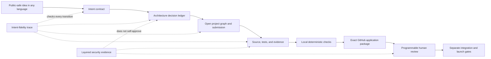

# Open-world v2 architecture

This document defines the target architecture for the local open-world v2 candidate. It is a design and review
contract, not evidence that v2 is released, live, audited, deployed, accepted by Programmable, or safe for production.
The checked-in schemas, validators, tests, release receipts and maintainer decisions remain the authority for those
separate states.

## Product boundary

Every product idea that can be described is eligible to enter intent capture and architecture review. Eligibility is
not approval of every requested mechanism. A missing template, unfamiliar mechanism, unknown capability name, unusual
language, external application, extra asset, custom price function, or custom lifecycle is not a product-category
rejection. Unknown designs enter custom architecture review.

Openness does not waive concrete safety constraints. A requested behavior still needs a funded and conserved value
flow, authenticated authority, explicit trust and custody, dependency integrity, executable failure and exit behavior,
conditional fee applicability and evidence proportionate to its risk. If the exact mechanism is unsafe, deceptive,
unbacked, or impossible, the Builder
must preserve the intended outcome where possible and propose a safe redesign. It must identify every material
difference instead of claiming that the original mechanism passed.

Templates are optional accelerators. They can supply reviewed defaults and reusable implementation pieces after intent
is understood; they are never an allowlist, an approval tier, or a substitute for the builder's idea.

## End-to-end flow



The transitions are deliberately one-way. Archive discovery, a starter, an agent translation, generated code, or a
review repair may not silently rewrite the original intent. A later artifact links back by stable ids and digests.

### 1. Capture the idea

The candidate preserves each public-safe builder message verbatim in an append-only idea source. Sensitive material is
not published or hashed into the public package; only a public redaction marker and reason may be stored. The machine
contract is [`idea-source-v1.schema.json`](../skills/programmable-v4-hook-builder/references/idea-source-v1.schema.json).

Application V3 has a narrow disclosure route for an intentionally public financial identifier. An optional
`publicDisclosureAttestations[]` entry binds the exact RFC 6901 pointer, SHA-256 of the matched identifier substring,
application id, owner-stated purpose and exactly one content-bound `public-disclosure-authorization` review record.
This changes only that exact candidate from privacy block to mandatory human review; it proves neither ownership nor
approval. Wrong, unused or blanket attestations remain held, and credentials, keys, tokens and passwords are never
attestable.

The source language remains attached to the entry. A working translation can be derived for an agent or reviewer, but
it cannot replace the original text or become the authority for what the builder requested.

### 2. Establish intent

The intent contract converts meaning into entities, facts, provenance and material ambiguities without relying on
English keywords. It records whether a fact is confirmed, inferred, proposed as a default, unresolved, or recovered
from legacy material. Open fact kinds remain valid when their non-executable payload is bound to a declared schema.

Only a choice that changes user outcomes, economics, value custody, authority, an external trust dependency, failure
behavior, exit behavior, or technical feasibility should interrupt the builder. Callback names, permission bits,
PoolKey ordering, file layout and other derived implementation choices are the agent's work. The human-readable
contract is [`intent-contract.md`](../skills/programmable-v4-hook-builder/references/intent-contract.md); the machine
shape is [`intent-contract-v1.schema.json`](../skills/programmable-v4-hook-builder/references/intent-contract-v1.schema.json).

After intent is sufficiently clear, one immediate route is recorded:

| Route | Meaning |
| --- | --- |
| `DIRECT_BUILD` | A known composition preserves the confirmed intent. |
| `CUSTOM_ARCHITECTURE` | The idea needs a new mechanism or composition and has no identified hard conflict. |
| `INTEGRATION_PENDING` | Design or submission can continue, but a separate platform or provider integration is absent. |
| `SAFE_REDESIGN` | The requested mechanism has a concrete unsafe, deceptive, unbacked, or impossible behavior. |

These routes describe the next product step. They are not implementation readiness, maintainer acceptance, deployment,
provider support, or launch authorization.

Only after this intent record exists may Registry discovery compare known projects for reuse, differentiation or
dependency analysis. A matched name, tag or similarity score cannot decide what the builder meant, reject a new idea,
inherit evidence, or approve a design. Any reused record stays bound to its exact repository, commit, tree and digest.

### 3. Translate intent into architecture

Each selected architecture decision links the relevant intent facts and ambiguities to alternatives, trust changes,
safety constraints, project-graph references, source paths, tests and evidence. The ledger is append-only: a new
decision supersedes an old one rather than editing history. Its machine contract is
[`architecture-decisions-v1.schema.json`](../skills/programmable-v4-hook-builder/references/architecture-decisions-v1.schema.json).

Structured facts are authoritative. Free text can suggest a question or conservative review, but the absence of a
particular word cannot disable an explicitly declared capability or turn novelty into an adverse result.

### 4. Materialize an open project graph

Open-world v2 separates the complete project from each exact v4 execution and fee scope. A canonical PoolKey is the
exact pair on which a declared launch or fee scope is evaluated; it is not a claim that the wider product contains only
two assets, one market, one hook, or one application.

The candidate machine contract is
[`submission-v2.schema.json`](../skills/programmable-v4-hook-builder/references/submission-v2.schema.json). Its root
artifact is `submission.v2.json` with `schemaVersion: 2` and `standardVersion: 2.0.0`. The `intentPackage` binds the
schema id, repository path, SHA-256 and byte length of `idea-source.v1.json`, `intent-contract.v1.json`,
`architecture-decisions.v1.json` and `intent-fidelity.v1.json`.

Its top-level graph supports:

- multiple `targets`, `assets` and open asset roles, while a canonical v4 execution scope still binds its exact
  PoolKey currencies;
- multiple `markets`, each with explicit assets, price-formation profile, hook reference, canonical scopes and
  `nativeAmmMode: none | optional | required`, plus an explicit execution class;
- multiple `hooks` and non-hook `components`, with explicit permissions, implementation and authorities and one exact
  non-bypassable fee path for each declared fee execution scope;
- contracts, interfaces, games, services, indexers, keepers, metadata and companion repositories as first-class
  project surfaces;
- new or existing assets, dynamic or fixed supply, burn, mint, redeem, claim and other explicitly modeled behavior;
- AMM, partially custom-accounted, or reviewed full-consumption custom-accounting paths;
- open `lifecyclePhases` linked as a graph, with token creation and AMM liquidity formation required only when the
  chosen architecture actually uses them;
- explicit `valueFlows`, `authorities`, `capabilityProfiles`, implementation bindings and review fragmentation; and
- owner-defined entity, asset, market, hook, component, phase, flow, authority, capability and decision kinds whose
  non-executable profiles are bound to a built-in or repository schema.

Every V2 EVM `chainId` is a canonical positive `uint256` decimal string (`"1"`, never the JSON number `1`). Zero,
signs, whitespace, leading zeros, fractions and values above `2^256 - 1` are invalid. This keeps the full EVM value exact
through JSON and JavaScript consumers instead of imposing the unrelated safe-integer ceiling.

Application V3, Registry Acceptance V3 and Launch V2 carry `applicationRevision` as a canonical positive decimal
string. It has no historical V1 integer, `1,000,000` or JavaScript safe-integer ceiling. Published V1 application
revisions preserve their original integer representation. V3 starts at `"1"`; every update binds the prior exact
revision and advances by exactly one under arbitrary-precision decimal semantics.

Published tags, exact historical v1 application bytes and their receipts are immutable evidence; they are never
reinterpreted or overwritten. Surgical corrections in this private working candidate do not change that history. New
semantics move forward through a new version or explicit migration. The v2 candidate is not publicly compatible until
its example, semantic validator, materializer, CLI, application generator and trusted central validator consume the v2
shape together. The release gate fails if only the JSON Schema exists or any consumer silently projects it back into
v1 semantics.

### 5. Preserve intent through code and tests

The fidelity ledger traces each core or material intent fact through architecture and implementation:

```text
source span -> semantic fact -> architecture decision -> component/source path -> test/evidence
```

Omission, inversion, an unconfirmed default, changed economics, added trust, changed exit behavior, or missing evidence
is visible as drift. Novelty is not drift. The schema is
[`intent-fidelity-v1.schema.json`](../skills/programmable-v4-hook-builder/references/intent-fidelity-v1.schema.json).

Implementation evidence is scoped to an exact repository revision. A declared test name, local report, static package
check, simulation or generated source is not automatically upgraded into an executed test, independent audit,
deployment receipt, provider result, runtime observation or maintainer approval.

### 6. Prepare the GitHub application

The project remains in builder-controlled public GitHub repositories. Application V3 is GitHub-only; another host, a
ZIP, pasted source or a private repository can support local exploration but cannot satisfy the public application
contract. It remains idea-eligible as `INTEGRATION_PENDING`, with no public package or write. The application package
binds immutable repository ids, commits, trees, source submissions and evidence instead of trusting branch names or
pasted summaries.
The v2 candidate flow is:

```text
open-world init -> intent and build -> open-world validate -> freeze source commits
  -> revision draft without revision/lineage -> open-world prepare-revision (GET-only)
  -> open-world application (zero-network full package) -> open-world submit/update plan
  -> explicitly confirmed GitHub write -> open-world status
```

The historical `doctor -> scaffold -> check -> package -> prepare-pr` and top-level submit/update/status flow belongs to
the published V1 transport and must not receive a V2 application. Preparing a V3 package does not push, publish or open a
pull request. The namespaced V3 submit/update commands first plan read-only and require explicit authorization for the
exact current digest before a GitHub write; status is read-only. The central pull request is a review thread and
immutable-source binding, not acceptance or launch authorization. See
[`PUBLIC_GITHUB_PR_BETA.md`](PUBLIC_GITHUB_PR_BETA.md); V2 must not claim compatibility until its generator, GitHub
client and trusted central validator are upgraded together.

`prepare-revision` is the only component that derives the canonical decimal revision and predecessor lineage. It
combines authenticated GET-only GitHub discovery with a complete local replay of every current source snapshot and
creates only `application.v3.json` in a new external output root when `--write` is explicit. The subsequent
`application` operation consumes that revisioned draft, the exact V2 package and review/security inputs; it uses no
network and derives the complete source-assessed package after another local snapshot check. Neither operation submits
or approves anything.

For updates, the current repository object database may replay an earlier commit when the numeric GitHub identity is
unchanged. A removed or replaced historical repository requires an explicit repeatable predecessor-root mapping only
when its exact objects are otherwise unavailable. This includes a removed inline companion in a mixed manifest/inline
predecessor. An all-inline predecessor that is fully replayable from the immutable remote package needs no such mapping.
Object unavailability is integration-pending; wrong object identity, content or closure is invalid. Output containment
also protects linked-worktree Git directories, shared common directories, the primary object store and recursively
referenced external Git alternate object stores. Initial malformed, unstable or unsafe alternate metadata fails before
any network request. Bounded root snapshots are revalidated before staging and atomic rename, so later drift fails
before final output materialization.

The target public application contract is
[`public-pr-application-v3.schema.json`](../skills/programmable-v4-hook-builder/references/public-pr-application-v3.schema.json).
The corresponding generated root artifact is `application.v3.json`; until the generator and trusted intake both emit
and validate that filename and contract, v3 application compatibility remains a release gate. The submitted artifact
is always `unreviewed`, inherits no approval and has no acceptance binding; a later human decision is a separate
authority record rather than a field the builder or agent may prefill.

The application does not duplicate a second normative copy of the owner's idea. It binds the exact idea-source
repository id, path and digest and may carry only a non-normative, public-safe display excerpt. Redacted or unavailable
intent keeps that excerpt null, so PR presentation cannot silently replace provenance or leak removed text.

All untrusted JSON and JSONL bytes are fatal-UTF-8 decoded and scanned for duplicate decoded keys before privacy,
semantic or integrity processing. Same-value, conflicting and Unicode-escaped duplicates fail identically; resource
ceilings become typed tooling/split-review states where applicable rather than product-category rejection.

Source-owned security and derived source evidence use a staged binding to avoid a cryptographic fixed point. A proposal
submission may keep its security-assessment binding null or point to an explicitly pending/unassessed draft that does
not claim the future source revision. After the source commit exists, the application generator derives the
source-assessed security instance and source-verification report into the central application package. Their records
use `source: application-package` and `repositoryRef: null`, while their contents bind the already-existing source
revision, tree and manifest. Launch or acceptance checks consume this application evidence; they never require a
source-committed report to predict the commit that would contain it.

Source closure has two transport modes without creating two product classes:

- `inline` is the small-package fast path. It binds one to 4,096 unique repository-relative source paths directly in
  each primary or companion repository record.
- `manifest` is the large-package path. The application carries no inline source paths and instead content-binds a
  versioned root manifest by repository path, SHA-256, byte length, Git blob object, entry count and fragment count.

Every primary or companion repository has a stable package-local id. Fee-policy, submission and source-repository
review records identify the exact repository id that owns their path. Coverage is evaluated per repository: a path or
manifest in one companion can never satisfy a binding in another repository.

The manifest contract is
[`source-closure-manifest-v1.schema.json`](../skills/programmable-v4-hook-builder/references/source-closure-manifest-v1.schema.json).
The application repository record binds the immutable repository id, commit and tree. The root manifest repeats the
repository id and URI, is itself bound as an exact blob inside that pinned tree, and binds a deterministic bytewise path
order, a closure digest and one or more ordered canonical-JSON-Lines fragments. Commit and tree are deliberately not
duplicated inside the manifest because embedding the tree that contains the manifest would create a Git self-reference.
Each fragment is bound by path, digest, byte length, Git blob, sequence, entry count and first/last path; every entry
binds its repository path, Git mode, Git blob, byte length, digest and review roles. A trusted validator must verify the
complete application-to-root-to-fragment-to-entry chain, ordering, ranges, counts, digests and Git objects rather than
trusting manifest claims.

The local candidate contract checker is
[`public-pr-application-v3-core.mjs`](../skills/programmable-v4-hook-builder/scripts/public-pr-application-v3-core.mjs).
It validates the closed application, path rules and source-mode invariants. Its local read-only verifier walks the
complete application-to-root-to-fragment-to-entry chain against raw Git objects from the exact pinned commit without
network access or candidate-code execution. The local corpus covers large multi-fragment closure, exact content/role
binding, non-canonical JSONL, replace refs, executable Git drivers and bounded split-review behavior. The 2026-08-03
root-owned local rerun passed, but it remains moving-worktree evidence rather than a frozen receipt and does not prove
that trusted central intake runs the same walk.

The 4,096 inline-path bound is therefore only a packaging fast-path limit. Crossing it selects the manifest transport;
it never means that a large repository, many-file game or unfamiliar architecture is unsafe, unsupported or
ineligible. Failure to materialize or verify a manifest is a precise tooling or evidence-closure problem and cannot be
reported as a product-category rejection. Until generation and trusted validation implement both modes end to end,
the manifest schema, local verifier and tests are candidate evidence rather than proof that large-package intake is
live.

The current Manifest V1 contract uses 40-hex SHA-1 Git object ids while separately binding source bytes with SHA-256;
committed paths must be UTF-8. A Git SHA-256 object database or non-UTF-8 path remains `INTEGRATION_PENDING` for this
application transport. A UTF-8 path above the generator's current 16 KiB byte budget produces `HOLD_SPLIT_REVIEW`.
The idea stays `ELIGIBLE_FOR_REVIEW`, and the generator performs no write in either hold. Other object formats or path
encodings require a new versioned closure schema, generator, verifier and migration; V1 must not be silently widened.

### 7. Hand a reviewed revision to independent launch review

GitHub review and launch authorization remain separate. The unsigned
[`launch-bundle-input-v2.schema.json`](../skills/programmable-v4-hook-builder/references/launch-bundle-input-v2.schema.json)
content-binds the exact application, v2 submission, fee policy, security assessment, evidence, source commits and
trees. Fee scopes and protocol contexts are arrays: product and protocol kinds remain open, while v4-specific checks
apply only to a declared Uniswap v4 context.

The bundle keeps the immutable fee recipient
`0x4957f49620AFf3Adbbe8195a4f633E49cc93376c` separate from the independent admin-authorizer wallet
`0x2Bb333d48DFAF1596D9036671d2E43168994249E`. Admin authority cannot claim, replace, redirect, sweep or net the fee
liability. Its input cannot inherit approval, and `humanAdminAuthorization` remains null. Structural validity means only
that an accountable reviewer has a closed request to assess; it is not a signature, deployment authorization,
transaction, runtime receipt or launch.

Registry acceptance is another content-bound input, not a boolean inferred from a merged pull request. Before acceptance,
the nullable binding is null and the bundle reports `UNRESOLVED` and `NOT_AUTHORIZED`. The accepted Registry record binds
the exact Application V3, source, Submission V2, Fee V2, security and verification reports plus the maintainer decision,
but omits the commit/tree that would contain itself. The outer launch input binds that record's exact Registry
repository, commit, tree, path, blob and digest, avoiding a second Git self-reference cycle.

The Builder-side V3 resolver is a read-only preflight bridge, not the platform trust root. Only its closed production
transport can mint a short-lived process-local receipt; an injected test transport can inspect the same projection but
is intentionally nonauthorizing. The platform must independently re-resolve the stable Registry numeric repository ID,
central pull ref, immutable author/reviewer IDs, merged lifecycle, approval and raw-Git inventory/change-set digests.
It must also double-snapshot central `refs/heads/main` and replay the exact bound acceptance path, Git blob and SHA-256
from that stable current commit. This keeps locally mocked success, stored or reverted acceptance JSON and a renamed or
deleted fork from becoming authority.

The Registry may also accept an exact zero-scope application with fee applicability `not-applicable` and no Fee V2
instance. That acceptance is a review decision, not a newly created Programmable execution scope. Launch V2 requires an
applicable canonical scope and therefore returns `NOT_AUTHORIZED` for the `not-applicable` record; an unrelated fee
artifact cannot override the derived state.

The request also binds one exact `execution-surface-coverage-v1` artifact. It must agree with the Application V3
revision, source-verifier aggregate, derived security hash, declared entrypoint artifacts, candidate and declared
closure, and the canonical Fee V2 scope. Any external surface must prove both reachability and independent control;
declaring an external venue cannot hide a canonical path or launder fee coverage. Missing, stale or mismatched coverage
is `CONFLICT`, never launch authority.

The corresponding
[`launch-bundle-output-v2.schema.json`](../skills/programmable-v4-hook-builder/references/launch-bundle-output-v2.schema.json)
is an unsigned deterministic preparation report. Its status is always `NOT_AUTHORIZED`; binding states remain
`MATCHED`, `UNRESOLVED`, or `CONFLICT`, and its transaction, signature and external-action arrays stay empty. It cannot
turn a clean structural analysis into admin authorization.

## Language and agent neutrality

The portable skill is the operating contract, but no individual agent is a trust root. Schemas, canonical JSON, hashes,
deterministic tools and explicit evidence states make machine artifacts host-neutral by design. They do not prove that
Codex, Claude Code, another Agent Skills host or a human will interpret every prompt identically.

The model-backed eval definitions keep subject and judge provider selection in an explicit run contract outside
semantic case/rubric artifacts. That makes the definitions provider-neutral, but it is not behavioral evidence for all
hosts, and no authorized model run is claimed. Before making a cross-agent parity claim, record separate authorized
receipts for OpenAI plus at least one additional provider/host. Adding a provider must not change the semantic suite or
invalidate deterministic artifacts.

The Builder must therefore:

- accept the builder's natural language and respond in it unless asked otherwise;
- preserve semantic provenance instead of requiring English protocol words;
- keep executable code out of schema-bound intent and decision payloads;
- select only the knowledge relevant to the current task;
- keep detailed protocol knowledge in routed references rather than expanding the entry skill indefinitely; and
- produce machine-readable findings whose severity depends on behavior and evidence, not on the agent that generated
  them.

The canonical package remains under
[`skills/programmable-v4-hook-builder/`](../skills/programmable-v4-hook-builder/). Its progressive loading is owned by
[`knowledge-routing.json`](../skills/programmable-v4-hook-builder/references/knowledge-routing.json).

## Fee profiles and compatibility

Fee-policy history is immutable. The existing `programmable-volume-fee-v1` policy and its reference kernel remain bound
to the applications and receipts that used them. Open-world v2 must not silently widen v1 limits or reinterpret a v1
receipt as proof of a new algorithm.

A fee-v2 profile is a new versioned contract with its own schema, implementation, vectors and conformance receipt. The
candidate contract is
[`fee-policy-v2.schema.json`](../skills/programmable-v4-hook-builder/references/fee-policy-v2.schema.json), identified
as `programmable-volume-fee-v2@2.0.0`; its policy math is isolated in
[`fee-policy-v2-core.mjs`](../skills/programmable-v4-hook-builder/scripts/fee-policy-v2-core.mjs), and its human review
contract is
[`programmable-fee-policy-v2.md`](../skills/programmable-v4-hook-builder/references/programmable-fee-policy-v2.md).

Portable schema bytes and project instances have different roles and paths. `fee-policy-v2.schema.json` defines the
contract; `fee-policy.v2.json` is a real project instance bound only after exact scopes and collection behavior exist.
A proposal keeps the instance null and fee applicability `unresolved`. Architecture derives exactly one state:

- `unresolved` while any execution surface could still be Programmable-canonical; it grants no exemption and is not
  prototype- or launch-ready;
- `applicable` when at least one actual `programmable-canonical` execution scope exists; the prototype must then bind one
  real instance by repository, path and digest with exactly one Fee V2 scope per canonical market; or
- `not-applicable` only when the complete graph proves there is no Programmable-canonical execution scope. A prototype
  in this state keeps the fee instance, fee conformance and fee-policy review record null rather than fabricating them.

The same separation
keeps `security-assessment-v1.schema.json` distinct from security evidence; schema bytes are never accepted as a
project assessment. A source-owned submission may keep the assessment null or pending. Derive the source-assessed
instance only after the source commit exists and bind it through application v3 without a self-reference cycle.

Every eligible profile preserves the platform economic invariant for each declared fee scope: the cumulative
whole-unit entitlement plus its carried remainder represents exactly 10 bps (0.10%) of executed gross quote-side swap
or fill volume for the immutable Programmable fee owner, and a builder-selected total charge is transparently split
without adding the platform share twice. The candidate defines `standard-amm`, `sync-custom-zero-amm`,
`async-fill-batch` and `custom-reviewed` collection profiles.
It accepts selected user-funded total rates below 100%, defines a verified gross witness for exact output, and keeps
platform and project remainders independently per exact `(chainId, poolId, quoteCurrency)` scope for fragmentation
resistance. Cross-scope netting is forbidden.

Each proposal market declares `executionClass: unknown | programmable-canonical | external | non-launchable`.
`unknown` preserves honest uncertainty, keeps project fee applicability `unresolved`, grants no fee exemption and must
be source-resolved before prototype or launch review. A `programmable-canonical` market makes the project `applicable`,
binds exactly one Fee V2 scope and uses the non-bypassable Programmable collection path. An `external` market is modeled
and reviewed but is not represented as execution performed by Programmable; a `non-launchable` market is descriptive
only. A complete graph containing only those two classes can derive `not-applicable` and binds zero Programmable fee
scopes. This classification cannot be used to relabel a Programmable execution path and evade its 0.10% platform share.

The bundled Solidity v2 reference kernel implements only `standard-amm`; its boundaries are documented in
[`programmable-volume-fee-v2/README.md`](../skills/programmable-v4-hook-builder/assets/reference-kernels/programmable-volume-fee-v2/README.md).
It is an accelerator, not an implementation of the zero-AMM, async or custom-reviewed profiles and not an audit,
deployment or universal hook. Each other profile needs its own exact implementation and evidence.

Tiny execution is not an idea-level ban. When whole-unit rounding makes one atomic execution unable to fund all
liabilities while preserving the declared user residual, the calculation creates no claimable liability. A declared
batch, sponsor, collateral or custom-reviewed settlement must move sufficient value into fee custody first. Deposits,
unfilled orders, cancellations and refunds are not executed volume.

No v2 profile is release-ready merely because a schema accepts a high rate or a tiny trade. Executable unit, fuzz,
invariant, static-analysis and independent conformance evidence must bind the exact profile and source. The release
gates are specified in [`OPEN_WORLD_V2_RELEASE_GATES.md`](OPEN_WORLD_V2_RELEASE_GATES.md).

For every actual applicable fee scope, `conformance.status = "complete"` requires `evidenceRefs`, exact
`evidenceDigests[]`, and one closed
`fee-conformance-receipt-v1` plus exact canonical `fee-conformance-vector-set-v1` pair in `scopeArtifacts[]` for every
fee scope, not a free-form reference. Together they bind the implementation artifact and source commit/tree, exact
scope/profile, execution-surface coverage, surface/mode mappings, vector set and every evidence digest; the validator
recomputes the policy result. User-funded modes reject rates at or above 100%. A custom rate at or
above 100% requires exact segregated sponsor/collateral funding plus prefunding solvency, underfunded-no-state-change
and refund/cancellation-obligation evidence. This remains structural evidence, not an audit, deployment or approval.

Evidence follows the real execution surface. Four direction-by-exactness vectors, callback authentication and
return-delta proofs are mandatory only for a canonical v4 swap/hook profile that exposes those modes. Async or non-hook
custom settlement proves its own fill, authorization, conservation and failure surface instead of manufacturing v4
callback evidence. A `not-applicable` project has no fee scope on which conformance could be completed.

## Layered security and safe redesign

Open-world security is evidence about concrete behavior, recorded at four separate layers:

1. **Intent** — what the builder asked for and which trust or loss properties are explicit.
2. **Configuration** — what the structured submission declares.
3. **Source** — what exact implementation and tests demonstrate.
4. **Runtime** — what deployed code, configuration and observed operations demonstrate.

A later layer may reveal a contradiction but may not erase an earlier observation. The structural envelope is
[`open-world-security-v1.schema.json`](../skills/programmable-v4-hook-builder/references/open-world-security-v1.schema.json).
Its separate versioned artifact is `security-assessment.v1.json`; it is not one of the four intent-package bindings and
cannot overwrite them. Keep source-owned proposal evidence null, pending or unassessed. Derive a source-assessed
instance and source-verification report only after the source revision is pinned, then carry them as central
application-package records with no source `repositoryRef`. Schema validity alone proves none of their security
statements.

The read-only source-signal extractor in
[`open-world-source-signals-core.mjs`](../skills/programmable-v4-hook-builder/scripts/open-world-source-signals-core.mjs)
adds conservative, language-scoped observations through optional top-level `automatedFindings[]`. Solidity rules run
only on explicit/matching `.sol` or build-info evidence; Rust, TypeScript, JavaScript, Python-like text and unknown media
do not inherit Solidity conclusions. It emits observed-positive signals or `unknown`; a missing regex, AST node, source
file or scanner feature never becomes `false`, safe, or not applicable. Partial, disputed or language-mismatched
findings remain independent-review holds, not automatic safe redesigns or launch blockers.

An adverse automated finding must identify the exact rule, bound artifact location and observed evidence. The builder
can attach counter-evidence but cannot waive or finally disposition its own finding. An unresolved or disputed finding
remains submit-able as `INDEPENDENT_REVIEW` or `HOLD`; neither state is implementation or launch authorization. A later
Registry- or maintainer-controlled decision record may disposition it as confirmed, remediated, not-applicable or
false-positive only when it content-binds the exact application revision, finding identity, evidence and accountable
reviewer. The decision does not erase the original observation, does not transfer to another commit and cannot waive a
funded-value, authentication or disclosure invariant. Unsupported syntax, incomplete tooling or conflicting evidence
routes to explicit review or split review; it never becomes the product-level verdict `UNSAFE` merely because the tool
could not understand a novel design.

Only correctly scoped, exact builder- or accountable-reviewer-confirmed predicates may route the design to safe
redesign. These predicates include hidden privileged value control; invariant-bypassing upgrade or movement below an
enforceable liability floor; payout redirection outside prior consent or an immutable rule; fee-floor or destination
bypass; an unbacked immediately redeemable or falsely guaranteed claim; seizure or redirection of owed value; absent
exit for an outstanding entitlement; unauthorized or undisclosed irreversible disposition; undisclosed/unbound managed
redemption; false autonomous exit;
participant-value or enforceable-entitlement exposure to biasable or unbounded-withholding randomness; and a no-op on
a return-delta branch that claims custom accounting. The original automated observation remains in history even when
later counter-evidence or disposition changes its review state.

Every component first proves its generic authorization, conservation, dependency, failure and exit boundaries. The v4
review boundary activates only for a confirmed v4 hook or unlock surface: immutable PoolManager authentication,
router-versus-user identity, exact permission bits, callback return shapes, settlement and zero remaining deltas after
unlock. Return-delta and swap-quadrant obligations activate only for exposed custom-accounting and canonical v4 swap
modes. Additional project surfaces receive their own threat models; they do not inherit hook evidence.

Capabilities are not hard predicates. A disclosed bounded authority, invariant-preserving rebalancer, sponsor-funded
and disclosed-bias randomness with no participant-funded or enforceable entitlement at risk, an authorized disclosed
burn or donation with no continuing entitlement, managed redemption with exact beneficiary/authority disclosure, and a
contingent/defaultable claim remain trust-tier and independent-review cases absent the exact unsafe predicate. Automated
checks cannot prove that an arbitrary project is safe, and an agent cannot approve its own output. Economic, trust,
legal, UX, residual-risk and launch decisions remain human review gates.

## Migration and recheck

Fresh ideas start through the local [`open-world.mjs`](../skills/programmable-v4-hook-builder/scripts/open-world.mjs)
`init` path. It reads exact UTF-8 public-safe idea text from an in-repository file and previews by default. With explicit
`--write`, it atomically creates a new directory containing `idea-source.v1.json`, `intent-contract.v1.json`,
`architecture-decisions.v1.json`, `intent-fidelity.v1.json`, `submission.v2.json`, `fee-policy-v2.schema.json`,
`security-assessment-v1.schema.json` and `security-assessment.v1.json`. The initial package is intentionally
unconfirmed, grants no readiness, uses no network and performs no GitHub application action. It does not invent a
project fee instance before architecture derives fee applicability. A bound `fee-policy.v2.json` becomes mandatory
before prototype readiness only for `applicable`; an exact `not-applicable` prototype keeps it null. The agent must then
interpret, propose, implement
and test the idea while preserving the original capture; `init` itself is not an architecture decision.

The checked-in [`new-idea/`](../skills/programmable-v4-hook-builder/assets/templates/open-world-v2/new-idea/) package
mirrors that fresh proposal shape and includes one repository-bound custom-profile schema as an extension example. It
is a starter and test vector, not a catalog of the only ideas or profile kinds the Builder accepts.

Historical applications are evidence, not mutable working files. The read-only recheck command
[`application-recheck.mjs`](../skills/programmable-v4-hook-builder/scripts/application-recheck.mjs) verifies an exact
historical six-file package and its bound local source checkout, preserves the original bytes and declared result, and
emits an unmaterialized target preview. Its core is
[`open-world-migration-core.mjs`](../skills/programmable-v4-hook-builder/scripts/open-world-migration-core.mjs).

The preview does not replay the historical validator, write a v3 application, access the network, inherit approval, or
claim intent fidelity. When original intent is unavailable, it marks the gap and requires recapture or explicit owner
confirmation before a separate new application revision can be created through the ordinary reviewed path.

After migration or recheck changes any current source, closure or evidence, regenerate a revision draft without
`applicationRevision` or `lineage` and rerun `open-world prepare-revision`. Preserve the old application bytes. Supply a
`--predecessor-source-root` only when the selected historical repository's exact objects cannot be replayed from the
current object database or immutable inline package; unavailable history is a tooling/transport hold, while mismatched
history remains invalid and can never be repaired by inventing lineage.

The local `open-world migrate` path is separate from recheck. It is a dry-run by default and binds the exact committed
legacy submission, HEAD commit and tree. With explicit `--write`, it may atomically create one new in-repository
directory containing exactly `legacy-migration-profile.v1.schema.json`, `idea-source.v1.json`,
`intent-contract.v1.json`, `architecture-decisions.v1.json`, `intent-fidelity.v1.json`,
`fee-policy-v2.schema.json`, `security-assessment-v1.schema.json`, `security-assessment.v1.json` and
`submission.v2.json`. The proposal binds no invented `fee-policy.v2.json` instance before architecture resolves fee
applicability and any actual scopes. It refuses an existing destination and never changes the historical source. `open-world validate`
reads a complete v2 directory without writing, executing project code, using the network, submitting or approving. A
materialized migration still has legacy-unconfirmed intent and unassessed fidelity until the owner recaptures or
confirms intent and the ordinary review path produces new evidence.

## State model

One overloaded status cannot represent this system. Consumers must keep these axes separate:

| Axis | Examples | What it does not prove |
| --- | --- | --- |
| Intent | draft, builder-confirmed, delegated defaults, legacy unconfirmed | feasibility or implementation |
| Product route | direct build, custom architecture, integration pending, safe redesign | review acceptance |
| Design readiness | unresolved, changes required, design ready | source exists |
| Fee applicability | unresolved, applicable, not-applicable | conformance, Registry acceptance or launch authority |
| Implementation readiness | not started, in progress, structurally complete | executed sandbox or audit |
| V2 package validation | invalid, valid, split review required | human review or approval |
| Application review | architecture review required, changes required, tooling blocked, maintainer accepted | deployment or launch |
| Launch preparation | matched, unresolved, conflict; always not authorized | signature, transaction or deployment |
| Runtime | not deployed, deployed and verified, monitored | broad provider support or economic safety |
| Availability | not indexed, indexed, quoted, tradable | endorsement or absence of risk |

Every result must use the strongest state its exact evidence supports and name the next authority required. Public
release, Registry activation, deployment, indexing and launch remain separate external actions.
